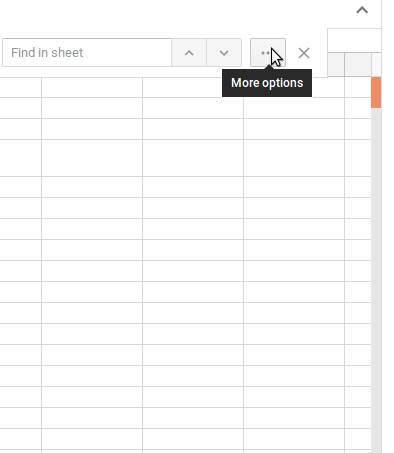
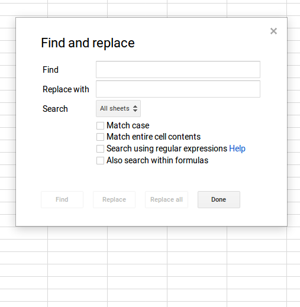
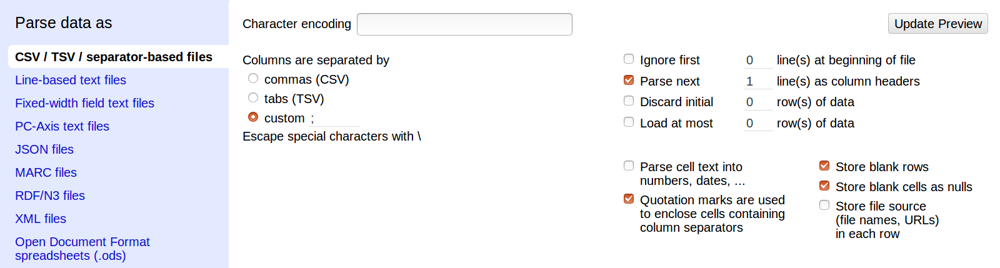
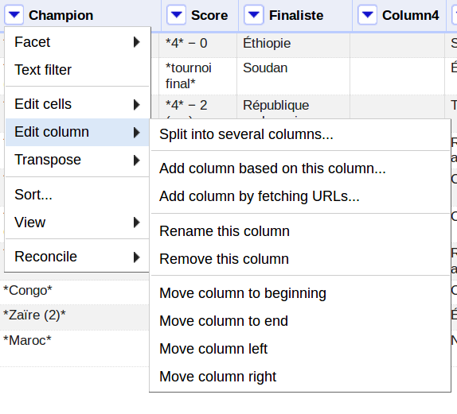
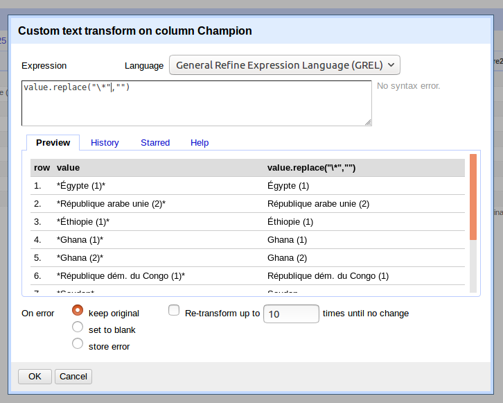
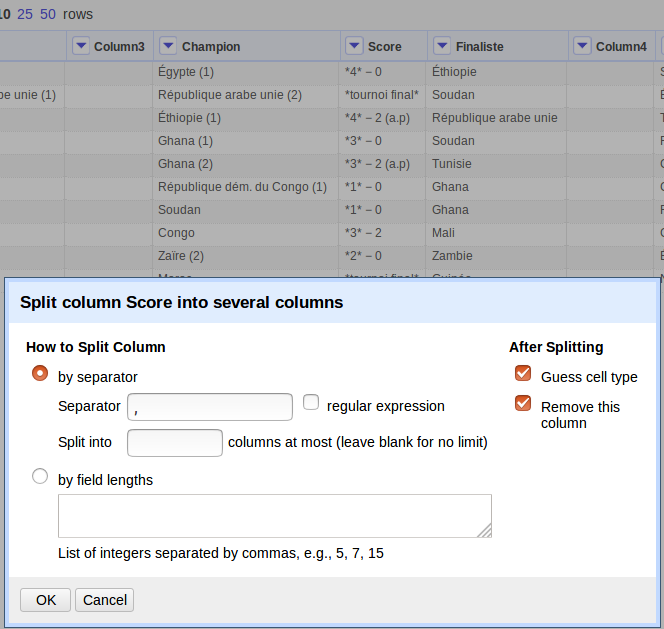
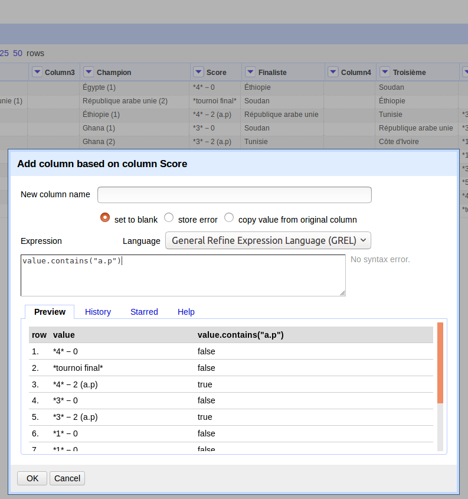
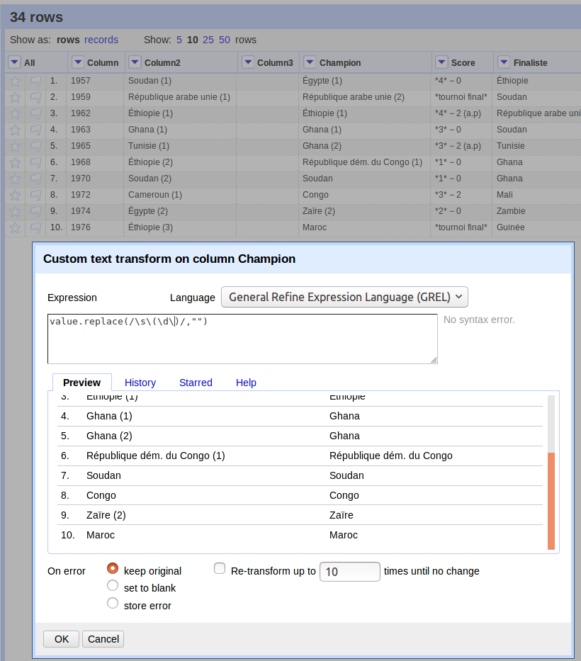

layout: true
  

`r paste0("
", params$event, " 

")` 

---

class: inverse, center, middle

# 3. Nettoyage et traitement

---

background-image: url("https://media.giphy.com/media/l2JdUqdX379mOqoq4/giphy.gif")
class: center, top, inverse

# Nettoyer les données

---

## Qu'est-ce qu'une "donnée sale" ?

Que ce soit pour des raisons techniques ou organisationnelles, il arrive que les données fournies en format tabulaire ou scrapées soient jugées "sales".

Une donnée est jugée sale quand son format gêne son utilisation, que ce soit par un humain ou par une machine.

Les problèmes rencontrés de la manière la plus courante sont :
1. problèmes de format ;
2. problèmes de nommage ;
3. problèmes d'unité ;
4. données "imbriquées".

---

## Qu'est-ce qu'une "donnée propre" ?

Une "donnée propre" est une donnée qui répond à quelques critères qui assure sa lisibilité et son usage sans déperdition de sens. Par exemple :
* une donnée correspond à la valeur d'une variable pour une observation ;
* les valeurs d'une même variable sont standards dans un tableau ;
* les champs sont disposés de manière à permettre calcul et manipulation.

---

## Problèmes clefs 1/3 : le typage
Une base de données a des problèmes de typage quand une donnée d'un certain type est identifiée comme étant d'un autre type. Le cas le plus courant : des valeurs numériques "lues" comme des chaînes de caractère.

**Conséquence directe** : les opérations requérants un certain type de données ne seront pas possibles ou faussées (à commencer par les opérations arithmétiques).

.red[&#9888; : l'erreur de typage ne sera pas forcément explicite. Certaines opérations (comme =sum() ) écarteront les valeurs non conformes de manière "silencieuses", faussant ainsi les calculs.]

---

## Problèmes clefs 2/3 : les décimales et milliers

Le problème de nomenclature qui enclenche le plus souvent des problèmes de typage est le conflit de système de notation numérique. Le système de notation français utilise en effet la "," comme séparateur des décimales et aucun ou bien un "\\s" comme séparateur des milliers. Le système anglosaxon utilise lui le "." comme séparateur de décimal et rien ou bien "," comme séparateur des milliers. D'un système à l'autre, les mêmes données numériques peuvent donc être mal interprétées voire mal typées.

**Conséquence directe** : mêmes conséquences que le typage (plantage de fonction) ou confusion entre les nombres (chiffres à 3 décimales après la virgule lus comme des milliers, par ex.).

---

## Problèmes clefs 3/3 : le nommage

Dans une base de données contenant des chaînes de caractère, les différentes valeurs possibles sont parfois nommées de manière non standard : avec ou sans majuscule, des espaces ici et non là, etc. La même valeur peut donc apparaître avec différents "nommage" dans une même variable.

**Conséquence directe** : au moment de faire des calculs, les valeurs nommées de manière différentes seront comptées à part. Les catégories se multiplieront et certains calculs seront faussés.

---

## Nettoyage manuel : find/replace

La plupart de ces erreurs peuvent être corrigées par des manipulations "trouver - remplacer".

Sous Google Sheets, l'interface est accessible avec un raccourci `Contrôle + F` :

.pull-left[]

.pull-right[]

---

## Open Refine

OpenRefine est un outil open source (bien que développé au départ par Google). Il est spécifiquement conçu pour nettoyer les données. Autrement dit : .red[ce n'est pas un tableur] ! Vous ne pourrez y faire ni calcul, ni manipulation, ni graph ...

Toutes les fonctionnalités d'OpenRefine se concentrent sur le nettoyage avec une approche spécifique :
#### la manipulation centrée sur les variables.

---

## Open Refine - installation

Comme Tabula, Open Refine est un logiciel développé en *Java*. Vous aurez d'abord besoin d'avoir installé son "environnement d'exécution", JRE (pour Java Runtime Environment).

Le logiciel lui-même se récupère [sur le site d'OpenRefine](http://openrefine.org/) sous forme d'une archive zippée.

Une fois dézippé, OpenRefine se lance comme Tabula via son icône. OpenRefine lance alors un terminal pour s'exécuter et ouvre un onglet dans votre navigateur par défaut à l'adresse local 127.0.0.1:3333.

*Bonne pratique* : histoire de ne pas la perdre, vous pouvez bookmarker cette URL et la nommer OpenRefine.

---

### Open Refine - importation

OpenRefine peut traiter quatre sources de données :
1. les fichiers importés depuis votre machine ;
2. les fichiers importés depuis une URL ;
3. les données copiées-collées depuis le presse-papier ;
4. les "Google Data".

OpenRefine reconnaît automatiquement le format et propose divers options d'import. Chaque modification met à jour l'aperçu :

Une fois configuré, vous pouvez choisir un nom pour votre projet et le créer (.red[&#9888; cette étape est obligatoire])

---

### Open Refine - fonctionnement

.pull-left[OpenRefine permet de modifier une base de données sur la base de ses variables, c'est-à-dire de ses "colonnes". La quasi totalité des options de transformation sont disponibles dans le menu déroulant à côté du nom de chaque colonne : toute modification paramétrée s'applique à la "colonne" où vous avez ouvert le menu.

Outre des fonctions de tableur classique (`sort`, `filter` et `transpose`) et de la mise en forme (déplacer les colonnes, etc.) OpenRefine propose surtout des outils de modification de cellules en série plus ou moins sophistiqués.]

.pull-right[]

---

### OpenRefine : find/replace

.pull-left[
L'aperçu vous donnera une idée du résultat. Elle sera appliquée à chacune des données de la variable choisie.]

.pull-right[La fonction "find/replace" est rendu possible par une fonction du langage interne à OpenRefine, le *GREL*, très proche du Javascript.

Pour modifier le contenu des cellules, vous devez sélectionner **Edit cells/Transform...**. L'interface vous propose alors la **"value"**. Pour lui appliquer une modification, vous devez ajouter une fonction. Pour remplacer, il s'agira de :
`value.replace("target","replace")"`]

---

### OpenRefine : créer une colonne à partir d'une autre

.pull-left[]

.pull-right[Autre fonction extrêmement utile et d'usage courant : "diviser" une colonne.

Le cas de figure typique (comme on le voit ici) : des données correspondants à des variables différentes ont été "piégées" dans une même cellule, soit par une mauvaise nomenclature (comme ici), soit suite à un problème technique.

Vous pouvez séparer les données en usant d'un séparateur : il vous suffit de sélectionner **Edit columns/Split into several columns...** et vous n'aurez plus alors qu'à paramétrer l'opération.]

---

### Open Refine - fonctions de ouf

Ces deux outils couvrent de très nombreux problèmes, que ce soit des problèmes de nomenclature ou de cellules à données multiples.

Mais plusieurs questions demeurent :
1. comment extraire des données pour créer une nouvelle variable ? [ex. ici : les modalités d'arbitrage en cas d'égalité.]
2. comment supprimer des chaînes de caractère indésirables quand leurs formats sont variés ? [ex. ici : le nombre de victoires]

---

### Open Refine : créer une variable

OpenRefine permet de "créer une colonne à partir d'une autre colonne". Pour ce faire, vous pouvez ouvrir l'interface dans allant dans **Edit columns/Add column based on column...**.

--

.pull-left[]

.pull-right[Vous devrez ensuite choisir une fonction. Ici, nous voulons savoir si la cellule "contient" une certaine expression qui va nous renseigner sur une autre variable (y a-t-il prolongation ou non ?). Nous allons donc effectuer un *test* : si la cellule "contient" ce terme, le résultat sera "vrai" sinon, il sera "faux". La formule utilisée est la suivante :
`value.contains("target")`]

---

### Open Refine : utiliser les regex

.pull-left[Plutôt que de faire des modifications à la chaîne, OpenRefine permet d'utiliser un puissant outil de description de chaîne de caractère : les *expressions régulières*. Ce méta langage utilisé dans à peu près tous les langages informatiques permet de décrire de manière symbolique des chaînes de caractère afin de couvrir plus d'un cas en une expression.

Ci contre, un exemple de regex permet de supprimer d'un coup tous les chiffres entre parenthèse.]

.pull-right[]

---

### Aparté : les expressions régulières

Les *expressions régulières* sont des outils extrêmement puissants si vous souhaitez faire du datajournalisme : elles permettent d'opérer des modifications importantes dans des textes, extraire des données précises, configurer des scripts complexes, etc. Leur structure, un peu déconcertante au début, répond à une poignée de règles logiques :
* les caractères peuvent être décrit de manière **littérale** ou **symobliques** : "un" 8 ou tous les chiffres ;
* certains caractères ont un sens particulier dans les regex. Pour les utiliser au sens littéral, il faut utiliser un "caractère d'échappement" : l'anti-slash "\" ;
* il est possible de proposer une gamme de caractères plutôt qu'un seul ;
* il est possible de spécifier plusieurs possibilités d'occurrence (toujours, une fois ou zéro, plusieurs fois ou zéro, un certain nombre de fois, entre tant et tant de fois, etc.).

Le principe des regex est de trouver des descriptions symboliques communes à plusieurs cas de figure, .red[ce qui signifie que plusieurs regex sont possibles pour un même groupe de chaînes de caractère.]

---

### Une méthodologie pour le français

Il est possible de lister les problèmes ou erreurs le plus souvent rencontrées pour les usager·ère·s de données en langue française et l'ordre dans lequel il est préférable de les corriger :

Données numériques :
* séparateurs décimaux (système FR vs US/UK) ;
* séparateurs de milliers (système FR vs US/UK) ;
* les "leading/trailing spaces".

Chaînes de caractères :
* les "leading/trailing spaces" ;
* les double-triple espaces ;
* la casse (majuscules et minuscules).

Tous types de données :
* rétablir le typage ;
* lisser la nomenclature.

---

background-image: url(https://media.giphy.com/media/l2Je3LhJtFQOQWnF6/giphy.gif)
class: center, top, inverse

# Demain, moins de calcul, plus de visuel !

---

class: inverse, center, middle

# Merci !

Contact : [sylvain@datactivist.coop](mailto:sylvain@datactivist.coop)

