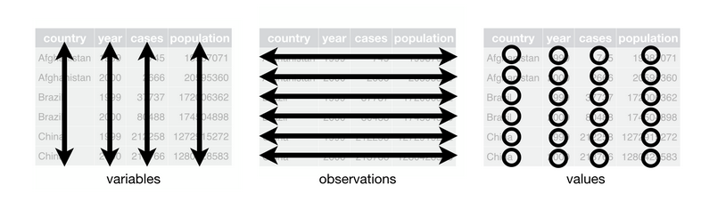
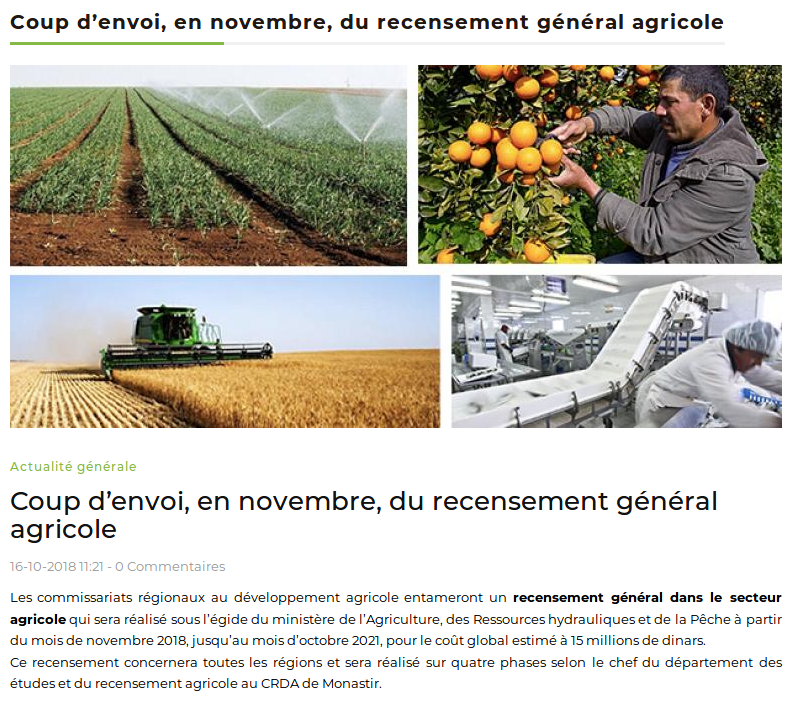
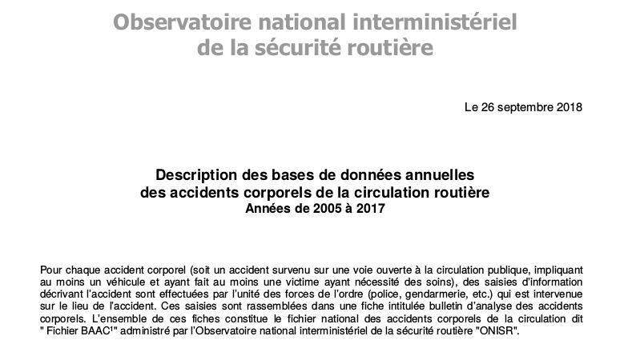

layout: true
  

`r paste0("
", params$event, " 

")` 

---

class: inverse, center, middle

# Présentation générale

---

## Le programme

La formation se déroulera au Capjc de 08h30 à 14h30 cette semaine suivant ce programme :

1. lundi 17 juin : culture de la donnée et sources
2. mardi 18 juin : récupération et scraping
2. mercredi 19 juin : nettoyage et traitement
2. jeudi 20 juin : datavisualisation
2. vendredi 21 juin : narration par la donnée et projet

--
  
### Evaluation
* **des participant·e·s** : par un questionnaire remis à l'issue de la formation ;
* **du formateur** : par des fiches d'évluation remises aux participant·e·s.

---

## Présentations

Je suis Sylvain Lapoix
* je suis datajournaliste indépendant
* enquêteur et coauteur pour le programme [**#DATAGUEULE**](https://www.youtube.com/user/datagueule) diffusé sur Youtube par France Télévision
* coopérateur au sein de la société **[Datactivist](http://datactivist.coop/)**, spécialisée dans l'open data
* formateur, notamment en Afrique subsaharienne avec le programme [Open Data Médias 2](https://www.cfi.fr/fr/projet/opendata-medias-2))
* consultant en usage de la donnée pour des ONGs [comme l'association Respire](https://www.respire-asso.org/pollution-de-lair-dans-les-ecoles/)
* journaliste-développeur, au sein du [consortium European Datajournalism network](https://www.europeandatajournalism.eu/), par exemple.

--

### Et vous, qui êtes-vous ?

---

## Principes

Cette formation repose sur trois principes inspirés de l'open source :
* bienveillance
* coopération
* partage

--

1. **bienveillance** : nous respectons la diversité d'opinions et de compétente. Toutes les questions sont les bienvenues, suivant ma devise : *"Mieux vaut une question bête qu'un silence gênant"* ;

2. **coopération** : nous travaillons collectivement et au profit du collectif. Certains exercices se feront en groupe, chacun·e est invité à partager ses idées, nous progressons ensemble ;

3. **partage** : toute la documentation de cette formation (liens, exercices ainsi que ces slides) est disponible [sur une page Github](https://github.com/datactivist/mediaup_ddj2019) en licence ouverte. Elle s'enrichira de vos apports au fûr et à mesure de la semaine.

---

## Les "trois étapes" du datajournalisme

.pull-left[Le journalisme "classique" :
1. recherche ;
2. traitement ;
3. mise en forme]

--

.pull-right[Le datajournalisme :
1. .red[*récupération de données*] ;
2. .red[*traitement de données*] ;
3. .red[*mise en forme*].]

--

Ces trois étapes ne sont pas un "circuit" à sens unique :
pour enquêter par les données, il est important de formuler des hypothèses, de les alimenter par d'autres données, de multiplier les approches en dataviz et de s'appuyer sur ces constats pour reformuler ses hypothèses.

Nous nous inspirerons de cette approche pour cette formation en y ajoutant un préalable (.red[*la culture de la donnée*]) et un cadre méthodologie (.red[*la narration par la donnée*]).

---

## Et pour quoi faire ?

En offrant des outils et des méthodes complémentaires au journalisme "classique", le datajournalisme offre de nouvelles perspectives mais facilite aussi des tâches courantes :

--

1. **tirer profit de nouvelles sources** (statistiques, techniques, etc.) ;
2. **trouver des sujets originaux** (notamment dans le questionnement des données elles-mêmes) ;
3. **vérifier des faits** et compléter d'autres sources ;
4. **identifier des sources, témoins, documents, événements, etc.** noyés dans la masse (effet *"[carte au trésor](http://owni.fr/2012/11/29/la-nebuleuse-suisse-des-copinages-public-prive/index.html)"*) ;
5. **traiter des quantités de données impossibles à manipuler autrement** ;
6. **contourner l'absence de source chaude** ;
7. **produire des formats originaux**

--

#### etc.

---

class: inverse, center, middle

# 1. La culture de la donnée

---

## Qu'est-ce qu'une donnée ?

Tout d'abord :

### Quelle est votre définition d'une donnée ?

--

Points clefs :
* unitaire ;
* figé ;
* consigné.

> "Une donnée, c'est quelque chose qu'on stocke dans une base de données"

Emmanuel Didier (sociologue de la quantification).

---

## Exercice : Chasse à la donnée

### .red[Vous avez 5' pour relever dans la salle 10 données (sans regarder d'écran).]

---

## Types de données

S'il existe une multitude de type de données, trois grandes catégories sont communes à la totalité des logiciels et langages de programmation qui permettent de les manipuler et de les stocker :

1. .red[**les données booléennes**] : VRAI / FAUX, il s'agit de la réponse à une question fermée.
2. .red[**les données numériques**] : toutes les valeurs numériques (mesure, quantité, produit, etc.), c'est-à-dire celles avec lesquelles on peut réaliser des calculs (on différencie parfois *integer*, entiers naturels, et *float*, avec décimale) ;
3. .red[**les chaînes de caractères**] : des séries de caractères avec lesquels on ne peut réaliser d'opération mathématique, depuis une lettre jusqu'à l'intégralité d'un livre.

---

## La base de données

Une base de données est un système de notation permettant de stocker des données de manière pratique et cohérente.

Elle comporte trois dimensions :

* .red[**les observations**] (en ligne) = les individus de la population ;
* .red[**les variables**] (en colonne) = les caractéristiques relevées ;
* .red[**les valeurs**] = les possibilités pour chaque variable.

Une donnée peut donc également être définie comme **la valeur prise par une variable pour une observation donnée**. En cela, elle est unique.

---

## Types de base de données

On différencie deux types de bases de données, suivant la manière dont elles sont collectées :

.pull-left[.red[**Les registres**]

]

.pull-right[.red[**Les enquêtes**]

]

---

### Pourquoi produit-on des données ?

---

### Comment fabrique-t-on une donnée ?

Les données sont le fruit d'une volonté, de moyen, de méthodes et de conditions. Elles nécessitent donc de l'argent, du temps, du personnel et des outils.

--

Ex. le recensement général agricole : 15 millions de dinars, 3 ans, 4 phases (source [Flehetna](https://www.flehetna.com/fr/coup-denvoi-en-novembre-du-recensement-general-agricole))

---

background-image: url(https://media.giphy.com/media/TJdnPMF1oYTuw/giphy.gif)
class: center, top, inverse

#### Conclusion : il n'y a pas de données "gratuites""

---

### Question de référence

Pour mesurer, nous avons besoin de références. Or pour créer des références, il faut des mesures. A votre avis pourquoi dit-on qu'une personne est en bonne santé quand sa température corporelle est de 37°C ?

--

.pull-left[**Carl Reinhold August Wunderlicht**

]

.pull-right[
Ce médecin allemand a collecté un million de mesure de température sur 25000 patient·e·s et établi le chiffre de 37°C comme la température interne d'un adulte "en bonne santé".

Ces relevés, compilés en 1868, on fait l'objet d'une vérification sur 148 patient·e·s d'un hôpital du Maryland au début des années 1990. Elle a confirmé les observations de Wunderlicht.

Source : [Markowiak et al., 1992](https://jamanetwork.com/journals/jama/article-abstract/400116).

]

---

### Les métadonnées

Les métadonnées sont des renseignements sur les données.

Parfois, cela se résume à quelques informations sur leurs modalités de publication et leurs mises à jour, [comme pour la production mensuelle de pétrole](http://catalog.industrie.gov.tn/dataset/production-petrolier-mensuel-par-region/resource/e74975f1-4e40-4b96-a66d-406b7edcb998).

--

Mais parfois, cela donne des renseignements sur la méthodologie détaillée.

Source : [INS](http://www.ins.tn/fr/methode/m%C3%A9thodologie-de-lenqu%C3%AAte-emploi).

---

### Questionner la méthodologie

Une approche critique de la donnée implique de questionner ses modalités de production, compilation et publication.

Source : [Data.gouv.fr](https://www.data.gouv.fr/fr/datasets/base-de-donnees-accidents-corporels-de-la-circulation/).

---

## Formats et licences

Le .red[**format**] correspond à la disposition des données dans le réel :

* données structurées ;
	* formats tabulaires ;
	  * formats propriétaires : XLSX, docx, etc.
	  * formats libres : CSV, XML, JSON, etc.
	* formats non tabulaires ;
		* HTML ;
		* PDF ;
* données non structurées ;
	* texte ;
	* autres.

--

La .red[**licence**] dicte les modalités de collecte, reproduction, modification, utilisation et publication des données et des produits qui en sont tirés.

---

### Profondeur des données

Les données présentent ainsi une plus ou moins grande profondeur.

Par leurs modalités de production, compilation et publication, elles révèlent :
* une volonté ;
* des méthodes ;
* des moyens ;
* des biais.

Chaque dimension peut être étudiée, critiquée et questionnée :
* modalités de collecte ;
* choix des observations, variables et valeurs ;
* choix des référentiels ;
* modalités de compilation (grannularité) ;
* modalités de publication : support, format, licence, etc.

--

Chacune de ces dimensions peut faire l'objet d'un questionnement journalistique, que ce soit pour des questions éthiques ou pour des raisons éditoriales.

---

### Exercice : que veut-on me dire avec ces données ?

---

background-image: url(https://media.giphy.com/media/z8qOTrLS4LUAw/giphy.gif)
class: center, top, inverse

# C'est tout pour aujourd'hui !

---

class: inverse, center, middle

# Merci !

Contact : [sylvain@datactivist.coop](mailto:sylvain@datactivist.coop)

